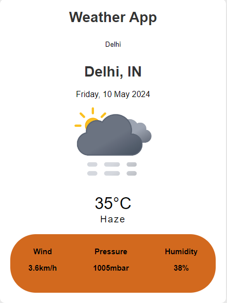

# Weather App
This project is a simple Weather App built using HTML, CSS, and JavaScript. It allows users to check the weather of any city by entering its name in the input field.

## Features
- Users can enter the name of a city in the input field to get its weather information.
- The app displays the city name, country, weather description, temperature in Celsius, and humidity.
- Weather icons change based on the current weather conditions.
- Responsive design: The app is optimized for various screen sizes.

## Usage
1. Clone the repository.
2. Open the index.html file in a web browser.
3. Enter the name of the city in the input field.
4. Press Enter or click outside the input field to get the weather information.

## Preview
[Visit](https://know-weather-status.netlify.app/)

## Credits
- Weather data provided by OpenWeather.
- Icons sourced from various platforms.

## License
This project is licensed under the MIT License - see the LICENSE file for details.